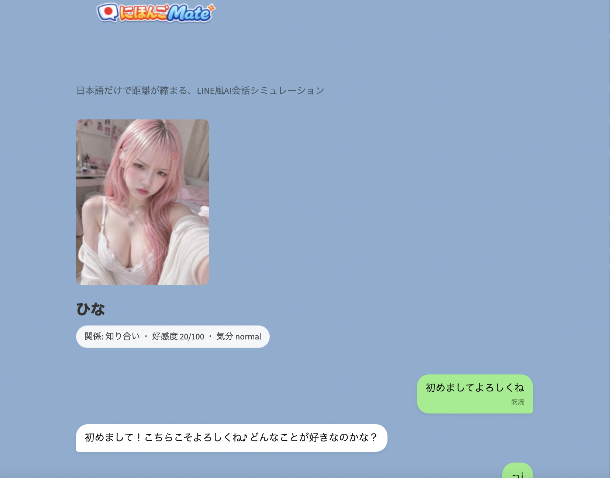

# NihongoMate

A LINE-style Japanese conversation simulator where learners practice Japanese through natural chat with an AI character.  
The relationship level changes depending on how well the message is understood.

## Demo

[Live Demo](https://zitatori-nihongomate-app-ntud4y.streamlit.app/)

## Screenshot



## Features

- LINE-style Japanese chat UI
- Japanese-only conversation
- Relationship level changes based on understanding
- Character mood reactions
- Replaceable character expression images
- SQLite chat history
- OpenAI API support
- Local fallback mode without API

## Tech Stack

- Python
- Streamlit
- SQLite
- OpenAI API

## Run locally

```bash
pip install -r requirements.txt
streamlit run app.py
- キャラクター追加
- PWA化
